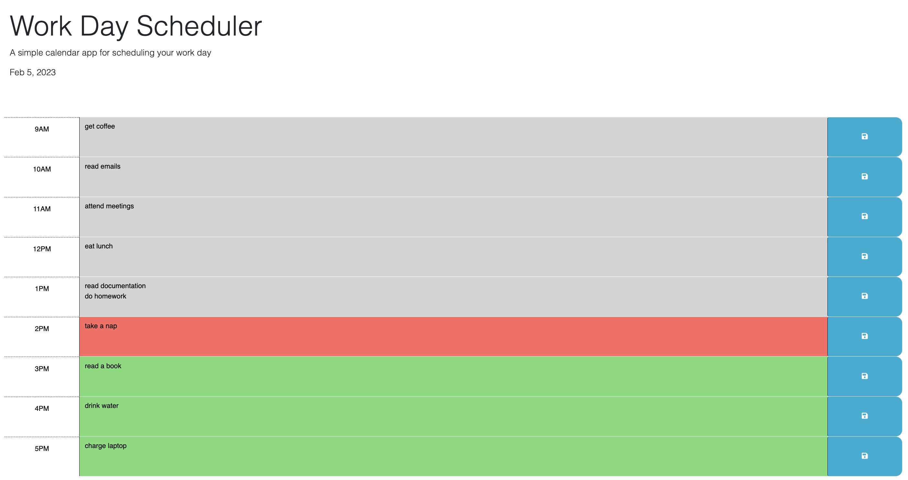

# Work-Day-Scheduler
A simple calendar application that allows a user to save events for each hour of the day

## Description

This page utilizes Web APIs to display a working day's hours to which you can save tasks that persist locally

## Usage

You can use this page to keep track of your tasks for the day

## Link to Deployed Application

https://lavanat.github.io/work-day-scheduler/

## Screenshot of Deployed Application

